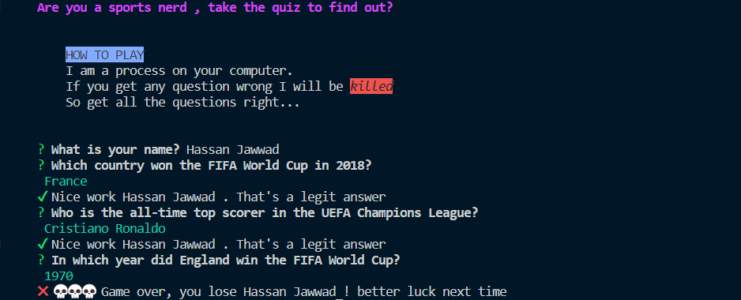

# Game-CLI
A CLI (command line interface) for a game.
 
It asks 5 genral knowledge questions about football and 5 about cricket.
 
You only move to the next question when you answer the previous one correctly. 
 
Commands I used while building:  npm i chalk chalk-animation figlet gradient-string inquirer nanospinner
 

You can play this using [npm i sports-quiz-cli](https://www.npmjs.com/package/sports-quiz-cli)

Run this on your terminal and you can play this game.

This is a glimpse of how it looks:

